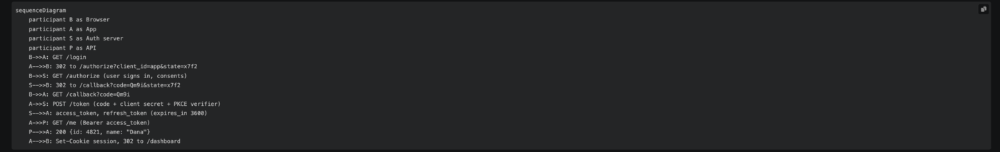
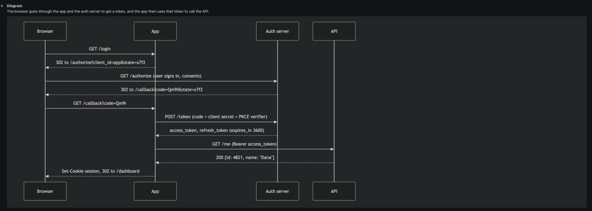
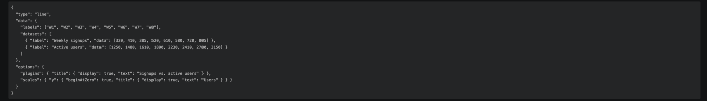
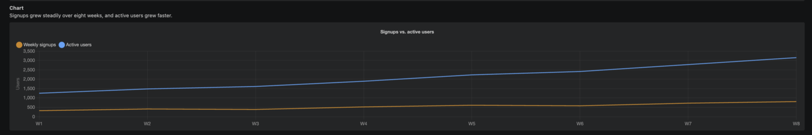
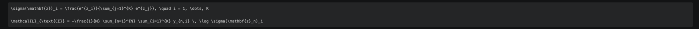
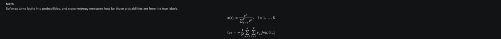
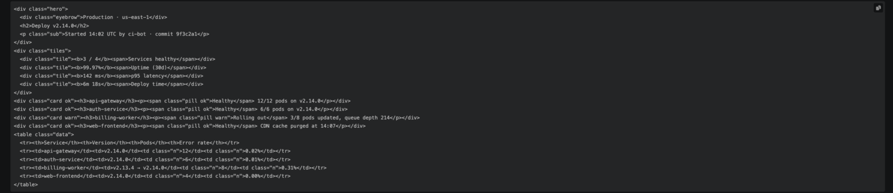
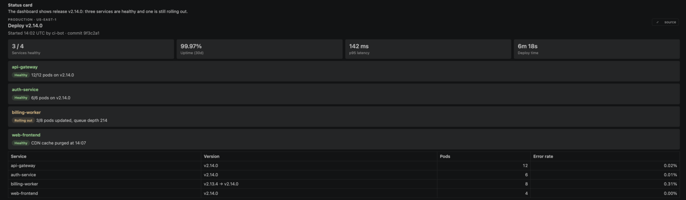
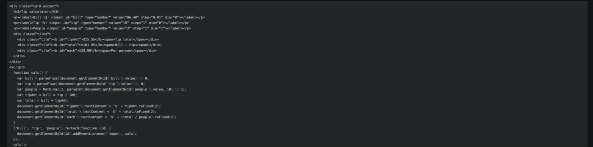
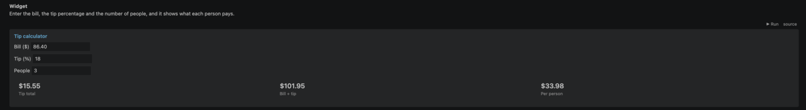

<p align="center"></p>

# OpenBuddy

<p>
  <a href="https://github.com/KeyurVaghani/openbuddy/releases/latest/download/openbuddy.vsix"></a>
  <a href="https://github.com/KeyurVaghani/openbuddy/releases/latest"></a>
</p>

Open-source add-ons for the **Claude Code chat in VS Code**. The first set renders rich replies:
when Claude writes one of these fenced blocks, OpenBuddy shows it as a live view right in the chat,
with a **source** toggle back to the code.

| Fence | Renders as |
|---|---|
| `mermaid` | Diagram (flowchart, sequence, state, ER, gantt…) with zoom, pan and full window |
| `chart` | Chart.js chart from a JSON config, with tooltips and a table view |
| `math` | TeX equations as MathML (plus simple inline `$…$`) |
| `html-preview` | Sanitized, style-isolated HTML with a built-in design system |
| `html-app` | Small interactive widget; runs only when you press **▶ Run** |

## Demo

https://github.com/user-attachments/assets/4115d3d2-cb60-41c0-bdab-be9cd8c28216

## What it looks like

Real screenshots of the same Claude Code reply, without and with OpenBuddy.

<table>
  <tr><th width="50%">Without OpenBuddy</th><th width="50%">With OpenBuddy</th></tr>
  <tr><td colspan="2"><b>Diagram</b> — a <code>mermaid</code> sequence diagram</td></tr>
  <tr>
    <td valign="top"></td>
    <td valign="top"></td>
  </tr>
  <tr><td colspan="2"><b>Chart</b> — a <code>chart</code> JSON config, coloured with Claude Code's own palette</td></tr>
  <tr>
    <td valign="top"></td>
    <td valign="top"></td>
  </tr>
  <tr><td colspan="2"><b>Math</b> — a <code>math</code> block</td></tr>
  <tr>
    <td valign="top"></td>
    <td valign="top"></td>
  </tr>
  <tr><td colspan="2"><b>Status card</b> — <code>html-preview</code> with the built-in design system</td></tr>
  <tr>
    <td valign="top"></td>
    <td valign="top"></td>
  </tr>
  <tr><td colspan="2"><b>Widget</b> — an <code>html-app</code>; its script runs only after you press <b>▶ Run</b></td></tr>
  <tr>
    <td valign="top"></td>
    <td valign="top"></td>
  </tr>
</table>

> **Unofficial.** OpenBuddy is not affiliated with or endorsed by Anthropic. It works by appending a
> script to the Claude Code extension's `webview/index.js`, so a Claude Code update can break it until
> OpenBuddy re-applies itself (it watches for updates and does this automatically).

## Install

1. Download [**openbuddy.vsix**](https://github.com/KeyurVaghani/openbuddy/releases/latest/download/openbuddy.vsix)
   (always the latest release; older versions are on [Releases](https://github.com/KeyurVaghani/openbuddy/releases)).
2. In VS Code: **Extensions → ⋯ → Install from VSIX…**, pick the file, then reload the window — or run
   `code --install-extension openbuddy.vsix` from the folder you downloaded it to.
3. Run **OpenBuddy: Copy Claude Instructions** from the command palette and paste the result into your
   `CLAUDE.md` (project or `~/.claude/CLAUDE.md`). This tells Claude which fences it can use —
   without it, Claude rarely writes them.

To undo the patch, run **OpenBuddy: Remove from Claude Code Chat** and then uninstall the extension.

## Safety

- `html-preview` is sanitized with [DOMPurify](https://github.com/cure53/DOMPurify) — scripts, iframes,
  forms and remote resources are stripped — and rendered in a shadow root so its CSS can't leak into the chat.
- `html-app` never runs on its own. Its scripts execute only after you press **▶ Run**, inside the
  [Sval](https://github.com/Siubaak/sval) interpreter with `fetch`, storage, `WebSocket`, `Worker`,
  `Function` and navigation removed. Stop clears its timers and listeners.
- `chart` takes JSON only; nothing in it is evaluated.

## Develop

```bash
npm install
npm run build       # → dist/extension.js, dist/injected.js
npm run watch       # rebuild on change
npm run typecheck   # tsc --noEmit
npm run package     # → openbuddy-x.y.z.vsix
```

To iterate on rendering without reloading VS Code, serve the repo root (`python3 -m http.server`) and open
`dev/harness.html` (add `?light` for the light theme). It recreates Claude Code's chat markup and theme
variables and loads `dist/injected.js`.

```
src/
  extension.ts          VS Code entry: patch on activate, self-heal, commands
  host/patcher.ts       append/remove a marked block in Claude Code's webview/index.js
  host/selfHeal.ts      re-apply after Claude Code updates
  webview/main.ts       the script appended to the chat webview
  webview/ticker.ts     runs feature steps on an interval, isolated from each other
  webview/fenceBlocks.ts  shared fence plumbing (source toggle, toolbar, full window)
  webview/*Blocks.ts    one renderer per fence
assets/preview.css      design system built into html-preview / html-app
docs/claude-instructions.md  the CLAUDE.md snippet
```

### Using OpenBuddy as a library

Another extension can build on OpenBuddy instead of re-implementing the patching:

```ts
// host side
import { createPatcher, watchBundles } from "openbuddy/host";
const patcher = createPatcher({ id: "MYEXT", injectedPath: path.join(__dirname, "injected.js") });

// webview side
import { richReplySteps, startTicker } from "openbuddy/webview";
startTicker([...richReplySteps, ["my-feature", myFeature]], "MyExt");
```

The entry points are TypeScript sources, so bundle them with esbuild (or similar) and define
`__OPENBUDDY_PREVIEW_CSS__` as the stylesheet string for the HTML fences. Install only one extension
that bundles OpenBuddy at a time — both would patch the same file.

## License

MIT
